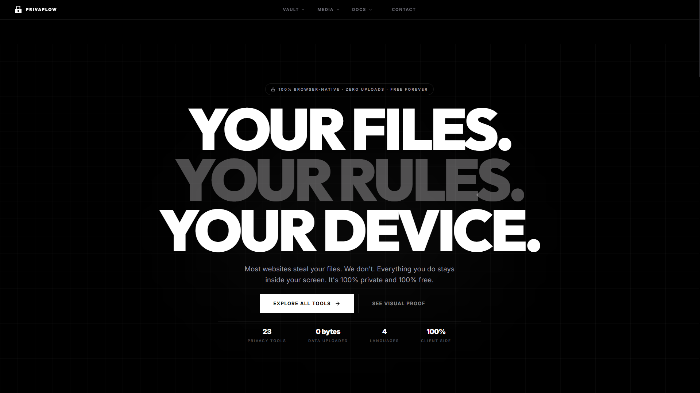

# PrivaFlow
### Your Files. Your Rules. Your Device.

**PrivaFlow** is a suite of 23 professional, 100% client-side, privacy-centric tools for image, PDF, and media processing. Every operation happens locally in your browser leveraging WebAssembly—no files are ever uploaded, ensuring total confidentiality and industry-leading speed.

---

###  Core Value Propositions

- **Zero Upload Policy**: Your data is processed in the browser's memory. It never touches a server.
- **WASM Powered**: High-performance processing using WebAssembly (`FFmpeg.wasm`, `pdf-lib`).
- **Fully Multilingual**: Native support for **English**, **Spanish**, **French**, and **Arabic**.
- **Privacy-First Design**: No tracking, no cookies, no analytics, 100% open-source transparency.

---

###  The Toolset (23 Professional Tools)

#### 🔐 Vault (Security & Privacy)
- **PDF Redactor**: Permanently black out sensitive information with industrial precision.
- **Exif Cleaner**: Strip hidden metadata (GPS, device info) from photos for safe sharing.
- **Secure Encryptor**: Lock messages with AES-256 cryptographic vaults.
- **Password Maker**: Generate cryptographically strong, high-entropy passwords.
- **File Repair**: Restore structural integrity to damaged or corrupted PDF files.

#### 🖼️ Media (Images & Video)
- **Background Remover**: IA-powered subject isolation and PNG extraction (100% local).
- **Image Enhancer**: IA clarification and noise reduction for blurry photos.
- **iPhone (HEIC) to JPG**: Convert Apple HEIC photos to universal JPEG formats.
- **Media Converter**: Professional video and audio transcoding via FFmpeg.wasm.
- **Image Optimizer**: Shrink file size significantly without losing visual quality.
- **Blur Tool**: Intelligently hide faces or sensitive zones in images.
- **SVG to PNG**: Render high-definition vector graphics into raster formats.
- **Watermark**: Protect visual assets with custom localized logos or stamps.

#### 📄 Docs (PDF & Documents)
- **PDF to Word**: intelligent reconstruction of editable Docx files from PDFs.
- **Word to Text**: Clean extraction of raw data from Word documents.
- **Text to Word**: Professional Docx synthesis from raw text inputs.
- **PDF Merger**: Combine multiple documents into a single secure file.
- **PDF Splitter**: Extract specific pages or ranges with total safety.
- **Digital Sign**: Draw and place natural signatures securely in the browser.
- **PDF to Image**: Export document pages as a high-resolution image gallery.
- **Unlock PDF**: Remove password-based usage restrictions localy.
- **Number Pages**: Precision pagination for document organization.
- **Organize Pages**: Effortless reordering and deletion of document pages.

---

###  Tech Stack

- **Framework**: [Next.js 15+](https://nextjs.org/) (App Router)
- **Styling**: [Tailwind CSS v4](https://tailwindcss.com/)
- **Animations**: [Framer Motion](https://www.framer.com/motion/)
- **Processing Power**: 
  - `ffmpeg.wasm` for media transcoding
  - `pdf-lib` & `pdfjs-dist` for document logic
  - `@imgly/background-removal` for AI isolation
  - `browser-image-compression` for pixel optimization
- **Internationalization**: `next-intl` (Fully localized EN, ES, FR, AR)

---

###  Local Development

1. **Clone the repository**
   ```bash
   git clone https://github.com/Ilyas-Nour/VaultNode.git
   ```
2. **Install dependencies**
   ```bash
   npm install
   ```
3. **Spin up the development server**
   ```bash
   npm run dev
   ```

---

###  Verifiability (Security Audit)

We encourage you to verify our **Zero Upload** claim:
1. Open your Browser DevTools (**F12**).
2. Go to the **Network** tab and check **Fetch/XHR**.
3. Process any file (remove a background, merge a PDF).
4. You will notice **no data packets** are sent to any external server. Everything stays on your metal.

---

© 2026 PRIVaflow · Built for the Open Web.
